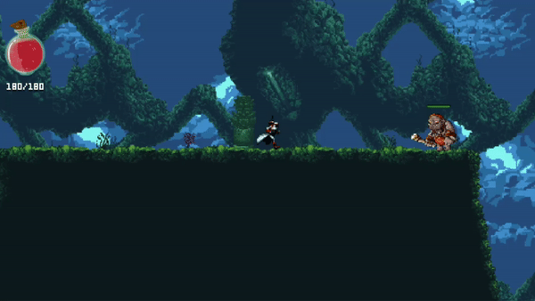

# Faceless

*Faceless* is a 2D platform game, which was a product of a process of learning Unity2D. Over time, features that I wanted to implement expanded, along with it the time I would have to put to fully develop the game. It was a great building-up experience with Unity environment and C#.

## GAMEPLAY

Faceless's *dash* attribute allows him to dodge enemy's attack

Are you worried that you cannot make that jump? Faceless can catch edges and climb on them!

Faceless can overpower his enemies by regular combo attack sequence

As well as by his special attacks

And that's how it looks when enemy overpowers the Faceless...

### Game offers over 15 enemies and each of them has their own unique skills.
One of them is ***Death***

And ***Elf Hunter***

## DEVELOPEMENT OF THE GAME IS CURRENTLY SUSPENDED.

